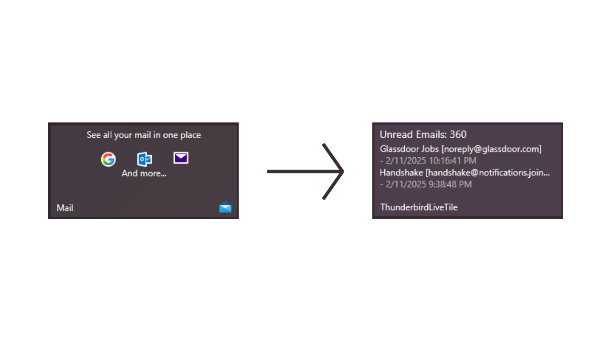

# Thunderbird Live Tile

This repository hosts a work-in-progress pertaining to a C# implementation of a live tile for Mozilla Thunderbird.

One of the primary features of the Metro design language for Windows 8 and Windows 10 is the start menu's live tile. This feature allowed programs to design dynamic start menu tiles that provide a user information beyond the simple name and/or icon of the program. In the case of the native windows mail app, it would inform the user the amount of unread emails in an inbox while presenting the subject and source of the most recent set of unread emails.

Windows 10 is nearing end of service for the average consumer. Despite the fact that the date hasn't been reached at the time of writing this README, Microsoft is proactively shuttering components of the operating system. This includes the native mail app. Recent updates have attempted to disable the mail app while installing the new Outlook express. Outlook express is a simple web wrapper for the Microsoft 365 software as a service. This lazy implementation has encouraged Microsoft to neglect the live tile component.

This project is an attempt to rectify this underused feature. I've created a working component that allows Thunderbird to communicate with a live tile to provide an email feed to the start menu.

## Current Progress

The current implementation requires Visual Studio to compile. This is done by opening and running the [ThunderbirdLiveTile](https://github.com/alanmmckay/thunderbird-live-tile/tree/main/ThunderbirdLiveTile) sub-folder of this repository.

The root folder of this repository contains a set of python scripts. These python scripts are accessed by running `install.py` using python. `install.py` will produce a folder called `extension` which contains `thunderbird_live_tile.zip`. This zip file is used to install an extension in Thunderbird using Thunderbird's extension manager. `install.py` will also create a native host application that acts as a bridge between the live tile program and the Thunderbird extension.

Once the Thunderbird extension is in place, a registry edit needs to be made within Windows. This is noted within [thunderbird_live_tile.json_location.txt](https://github.com/alanmmckay/thunderbird-live-tile/blob/main/thunderbird_live_tile.json_location.txt)

## Future Progress

This project depends on a python native host app. I would like to cut out this middleman and host the logic within the C# UWP app. Additionally, the UWP app itself needs to be packaged to eliminate any reliance on requiring Visual Studio to be installed. The installation script also needs to set up the correct registry entries to allow the host app to be used.
